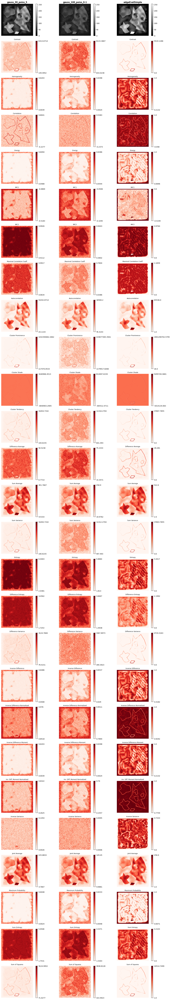

# Haralick Texture Features

A Python implementation of Haralick texture features or Gray Level Co-occurrence Matrix (GLCM) features for digital image processing.

These features are widely used in medical imaging, remote sensing, and computer vision for texture analysis and classification. This work provides a pipeline for extracting Haralick texture features from grayscale images using Gray Level Co-occurrence Matrices (GLCM). In this analysis I delve into the characteristics of these features. Characteristics include what features they may highlight from an image, or robustness; variance (rotation, gray level, image scale). This is done by applying texture features to randomly genrated toy images; identifying optimal GLCMs for each feature; and analysis of synthetic GLCMs.

The experimental design involves generating $8 \times 8$ binary images where each pixel is an independent and identically distributed (i.i.d.) Bernoulli random variable (only 2 gray levels). Nine distinct Bernoulli probabilities, $p \in \{0.1, 0.2, 0.3, 0.4, 0.5, 0.6, 0.7, 0.8, 0.9\}$, are used to cover a variety of image outcomes. The variance of the features accross the generated samples, are observed.

 

## Guide

Start with the 'Htf.pdf' file to go over notation and the list of all the features. 

The main experiments can be found in 'Experiments.ipynb' and 'Experiments_p2.ipynb'. In 'feature_char.ipynb', there is an introduction to the charecterization of the features by minimizing and maximing the features.

In 'toy_images.ipynb' you can find $8 \times 8$ generated images (more complex images will be generated), to get a visual sense of the distinct textures that the features measure. 'Validation.ipynb' consists of executions of the functions as a sample test. 'features.py' under the src folder holds all the functions for the features (not available in the scikit-image package).

  

Input image source: Synthetic Dataset from Rafael Reisenhofer and Emily J. King, 2019. "Edge, Ridge, and Blob Detection with Symmetric Molecules" 
https://github.com/rgcda/SymFD/tree/master/Data/Synthetic%20Images 

